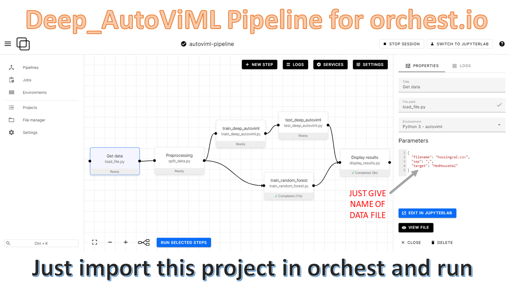

# Deep AutoViML Pipeline for orchest.io version 2.0

Quickstart pipeline to build Deep Learning models with a single line of code: [deep_autoviml](https://github.com/AutoViML/deep_autoviml). Updated recently to fix a minor bug.

Deep AutoViML helps you build tensorflow keras model pipelines in a single line of code. You can now do the same using orchest.io data pipelines with this project example.

